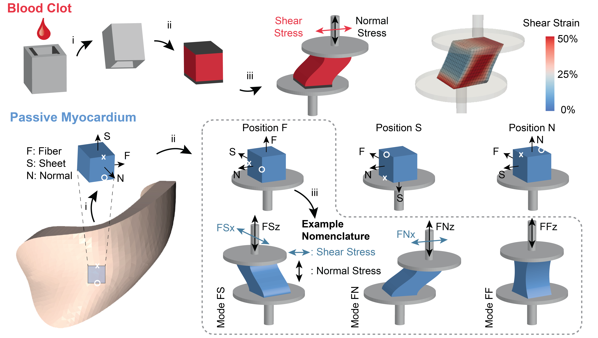

# Machine learning-based soft material parameter identification

## Requirements
In addition to other commonly used python modules and libraries, this pipeline is dependent on the following modules
* [Scikit-learn](https://scikit-learn.org/stable/)
* [PyTorch](https://pytorch.org/)
* [LMFIT](https://lmfit.github.io/lmfit-py/)
* [SciPy](https://www.scipy.org/)
* [Pickle](https://docs.python.org/3/library/pickle.html)
* [imageio](https://pypi.org/project/imageio/)

## Data description
We provide the synthetic data in two formats: a) raw csv files and b) python objects saved in \*.sav format using the pickle library. In case (a), for each FE simulation we generate two files with the naming convention "DataZ.csv" and "ParamsZ.csv", where "Z" is the unique number of sample. The "DataZ.csv" file contains the force-strain curves and the "ParamsZ.csv" file values of the feature space as described in the extended methods supplement. Note that for the case of myocardium the corresponding files are denoted as "DataZ_M%.csv"  and "ParamsZ_M%.csv" where the "%" stands for the testing mode in the range 1-9, according to the name convention FS, FN, FF, SF, SN, SS, NF, NS, NN (see Figure 2 of the original publication). Strain has no units, force and dimensions are expressed in [N] and [mm], respectively.

Similarly, we provide the experimental data of  each case. Detailed documentation regarding the experimental data, protocols and relevant conventions can be found in our [Open Data Repository](https://dataverse.tdl.org/dataverse/STBML) or the original pubications on the [mechanics of blood clots](https://www.sciencedirect.com/science/article/pii/S1751616120307566) and [passive right ventricular myocardium](https://www.sciencedirect.com/science/article/pii/S174270612030711X). In summary, we provide the following  data:

1. Synthetic data of finite element (FE) simulations for
    1. Blood clot modeling (Ogden material law)
    1. Passive myocardium modeling (Holzapfel material law)
1. Experimental force-displacement curves of
    1. Simple shear testing of blood clot
    1. Multi-modal testing protocol of passive myocardium

## Code description
We provide the code as used in the original manuscript for machine learning-based parameter identification. For more details on the methods, hyperparameter tuning and the feature/target space definition we refer the reader to the supplementary material. This repository includes scripts for the following tasks:
* Training forward stress-strain metamodels for the following cases: 
  * Blood clot GPR (A1)
  * Blood clot NN (A2)
  * Myocardium GPR (A3)
  * Myocardium NN (A4)
* Training neural network regressors for the following cases:
  * Blood clot NNR (B1)
  * Myocardium NNR (B2)
* Least-squares optimization for material parameter identification using experimental data and the trained forward stress-strain metamodels for cases A1-A4, at the scripts C1-C4, respectively.
* Material parameter identification using experimental data and the NNR approach (D1 and D2).